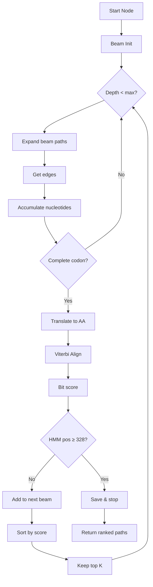
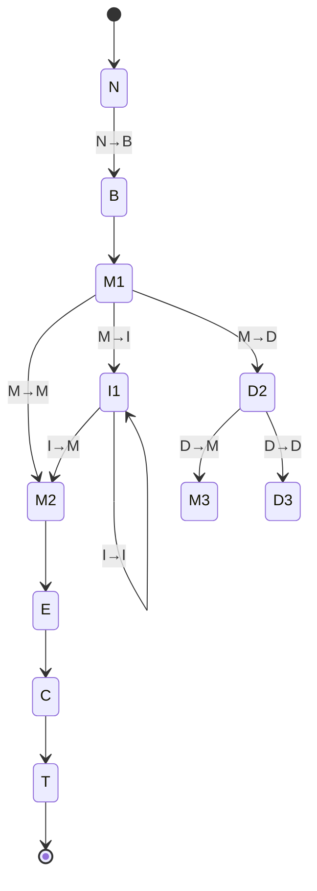
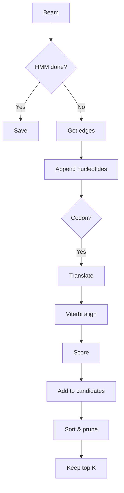

# HMM-Guided Beam Search

Beam search + Viterbi alignment for optimal de Bruijn graph paths matching profile HMM. DNA → amino acid translation with HMMER3 log-odds scoring.

## Algorithm Flow



## Scoring Pipeline


## Components

### Profile HMM Parser
**Files**: [include/profile.h](include/profile.h), [src/profile.cpp](src/profile.cpp)

**Methods**:
- `LoadFromFile()` - Parse HMMER3
- `GetMatchEmission(pos, aa)` - log P(aa|match)
- `GetTransition(from, to)` - log P(transition)
- `ViterbiAlign(sequence)` - DP alignment

**Parsing**: HMMER3 stores `+X` (-log P), we convert to `-X` (log P)

### Viterbi DP

**State Machine**:


**DP Recurrence**:
```
dp[i][j][M] = emit_M(j,aa[i]) + max(
    dp[i-1][j-1][M] + trans(M→M),
    dp[i-1][j-1][I] + trans(I→M),
    dp[i-1][j-1][D] + trans(D→M),
    xmx[i-1][B]
)

dp[i][j][I] = emit_I(j,aa[i]) + max(
    dp[i-1][j][M] + trans(M→I),
    dp[i-1][j][I] + trans(I→I)
)

dp[i][j][D] = max(
    dp[i][j-1][M] + trans(M→D),
    dp[i][j-1][D] + trans(D→D)
)
```

**Null Model Correction**:
```
raw_viterbi = Σ [log P(aa|HMM) + log P(transition)]
null_score  = Σ log P(aa|background)
log_odds    = raw_viterbi - null_score
bit_score   = log_odds / log(2)
```

**Stop Codons**: Return -∞ → path rejected in beam

### Beam Search

**Algorithm**:


**Parameters**:
- Beam width: 10
- Max depth: HMM_length × 3

**Termination**: HMM position ≥ 328, depth exceeded, or no expansions

## Scoring Details

| Stage | Operation | Example |
|-------|-----------|---------|
| Parse | Negate | +2.90 → -2.90 |
| Emission | Table lookup | -2.90958 |
| Transition | Table lookup | -0.00968 |
| Viterbi | Sum log P | -1413.38 |
| Null | Σ background | -1513.59 |
| Log-odds | Subtraction | +100.21 |
| Bits | ÷ log(2) | 100.21 |

## Validation

| Metric | CasGeneDetector | HMMER | Difference |
|--------|----------------|-------|------------|
| Score | 105.259 bits | 105.5 bits | 0.23% |
| Sequence | 362 AA | 362 AA | - |
| Coverage | 328/328 | 296/328 | Global vs local |
| Alignment | 323M, 37I, 2D | Local | - |

**704 profiles**: 2.16% average difference

## Performance

**Test case**: 4M nodes, k=23, 1064 nodes traversed
- Time: 4.9s
- Paths: 2
- Amino acids: 362

**Complexity**:
- Viterbi calls: O(W × D) ≈ 12,000
- Per call: O(N × M) ≈ 118,000
- Total: ~1.4B operations

**Optimization potential**: 50-100x speedup (caching, incremental updates, parallelization)

## Usage

```bash
./test_cas_gene_detector <graph> <hmm> <start_node>
```

**Output**:
```
Score: 105.259 bits
Nodes: 1064
Amino acids: 362
HMM coverage: 323/328
```

## Files

**Core**:
- [include/profile.h](include/profile.h) - HMM class
- [src/profile.cpp](src/profile.cpp) - Viterbi
- [include/cas_gene_detector.h](include/cas_gene_detector.h) - Beam search
- [src/cas_gene_detector.cpp](src/cas_gene_detector.cpp) - Implementation

**Utilities**:
- [src/test_cas_gene_detector.cpp](src/test_cas_gene_detector.cpp) - Test program
- [src/build_graph_cli.cpp](src/build_graph_cli.cpp) - Graph builder
- [src/find_kmer_id.cpp](src/find_kmer_id.cpp) - K-mer lookup

## References

1. Eddy SR. (2011) Accelerated Profile HMM Searches. *PLoS Comput Biol* 7(10): e1002195.
2. Durbin R, et al. (1998) *Biological Sequence Analysis.* Cambridge University Press.
3. HMMER User Guide. http://eddylab.org/software/hmmer/Userguide.pdf
