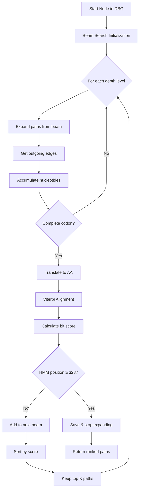
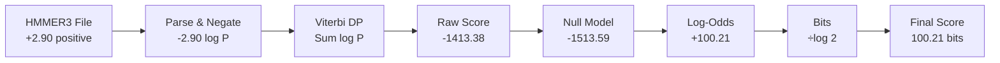
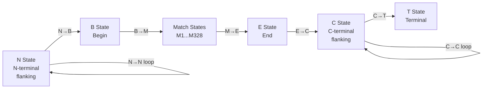
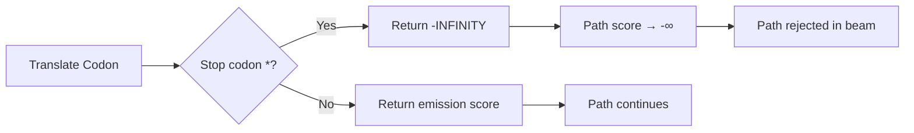
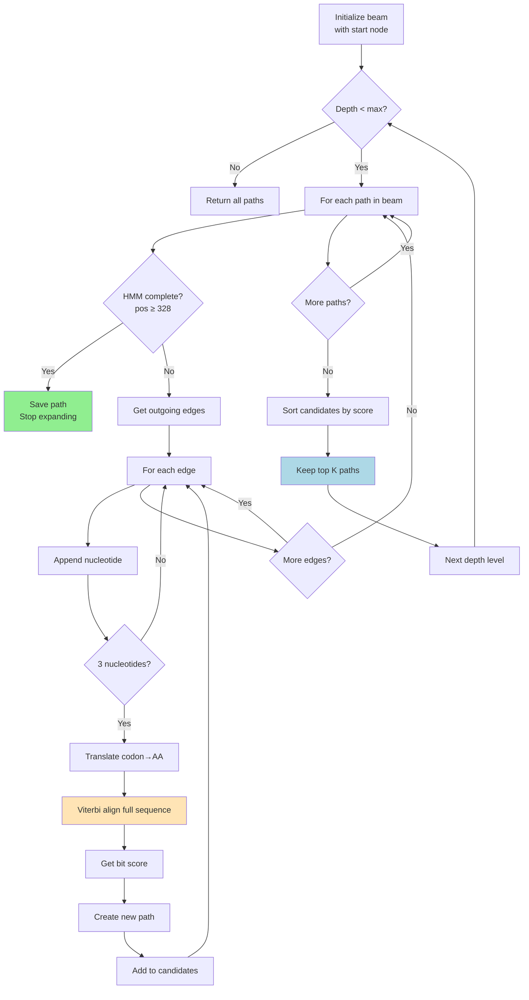
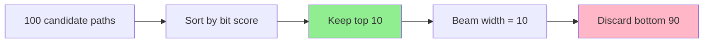
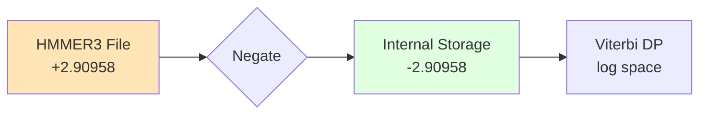
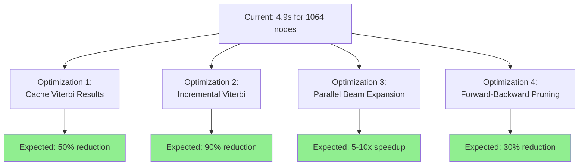

# HMM-Guided Beam Search

## Algorithm

Beam search + Viterbi alignment to find optimal paths through de Bruijn graph matching profile HMM. DNA → amino acid translation with HMMER3-compatible log-odds scoring.

## High-Level Flow



### Scoring Pipeline



## Components

### 1. Profile HMM Parser (`profile.h/cpp`)

**Purpose**: Loads and parses HMMER3 HMM files

**Key Methods**:
- `LoadFromFile(filename)` - Parses HMMER3 format
- `GetMatchEmission(pos, aa)` - Returns log P(aa | match state)
- `GetInsertEmission(pos, aa)` - Returns log P(aa | insert state)
- `GetTransition(from, to, type)` - Returns log P(transition)
- `ViterbiAlign(aa_sequence)` - Full Viterbi DP alignment

**HMMER3 Format Parsing**:
```
File stores:     +X (positive values representing -log P)
We convert to:   -X (negative log probabilities)

Example:
  File has:  2.90958  (meaning -log P = 2.90958)
  We store:  -2.90958 (log P)
```

**Scoring Dimensions**:
- Match emissions: `log(P)` - negative log probabilities
- Insert emissions: `log(P)` - negative log probabilities  
- Transitions: `log(P)` - negative log probabilities
- Background (COMPO): `log(P)` - negative log probabilities

### 2. Viterbi Algorithm (`ViterbiAlign`)

**Purpose**: Find optimal alignment of amino acid sequence to HMM using dynamic programming.

**State Machine**:

```mermaid
stateDiagram-v2
    [*] --> N: Start
    N --> B: N→B
    B --> M1: Begin
    M1 --> M2: M→M
    M1 --> I1: M→I
    M1 --> D2: M→D
    I1 --> M2: I→M
    I1 --> I1: I→I
    D2 --> M3: D→M
    D2 --> D3: D→D
    M2 --> E: Match→Exit
    E --> C: E→C
    C --> T: C→T
    T --> [*]: End
    
    note right of M1: Match: consume AA<br/>advance HMM
    note right of I1: Insert: consume AA<br/>stay at HMM
    note right of D2: Delete: skip HMM pos<br/>no AA consumed
```

**Dynamic Programming Recurrence**:

```
dp[i][j][M] = emit_M(j,aa[i]) + max(
    dp[i-1][j-1][M] + trans(M→M),
    dp[i-1][j-1][I] + trans(I→M),
    dp[i-1][j-1][D] + trans(D→M),
    xmx[i-1][B]              (entry from B state)
)

dp[i][j][I] = emit_I(j,aa[i]) + max(
    dp[i-1][j][M] + trans(M→I),
    dp[i-1][j][I] + trans(I→I)
)

dp[i][j][D] = max(
    dp[i][j-1][M] + trans(M→D),
    dp[i][j-1][D] + trans(D→D)
)
```

**Special States** (HMMER Plan7):



**All 7 Transitions Used**:
- M→M, M→I, M→D (from Match state)
- I→M, I→I (from Insert state)
- D→M, D→D (from Delete state)

**Null Model Correction** (Log-Odds Scoring):

```mermaid
flowchart TD
    A[Viterbi Score<br/>Σ log P seq|HMM] --> C[Log-Odds]
    B[Null Score<br/>Σ log P seq|background] --> C
    C --> D[Divide by log 2]
    D --> E[Bit Score<br/>HMMER-compatible]
    
    style A fill:#e1f5ff
    style B fill:#ffe1e1
    style E fill:#e1ffe1
```

Formula:
```
raw_viterbi = Σ [log P(aa|HMM_state) + log P(transition)]
null_score  = Σ log P(aa|background)
log_odds    = raw_viterbi - null_score
bit_score   = log_odds / log(2)
```

**Stop Codon Handling**:


**Returns**: `{bit_score, alignment_path, hmm_end_position}`

### 3. Beam Search Traversal

**Core Algorithm**:


**Beam Pruning Strategy**:



**Parameters**:
- `beam_width`: 10 paths (configurable)
- `max_depth`: 1200 graph steps (configurable)

**Termination Conditions**:
1. HMM position ≥ 328 (full alignment)
2. Depth exceeds max_depth
3. No valid expansions remaining

### 4. Stopping Criterion

**Goal**: Stop when HMM is fully aligned (all 328 positions covered)

**Implementation**:
```cpp
if (state.hmm_position >= profile_->GetLength()) {
    // HMM complete - save path
    result_paths.push_back(path);
    continue;  // Don't expand further
}
```

**Why it works**:
- Viterbi returns `hmm_end_pos` = highest HMM position reached
- Can be < 328 (local alignment) if sequence ends early
- = 328 when full HMM is covered (including deletions)
- Beam search stops expanding that path when reaching 328

## Scoring Scheme

### HMMER3 Format Parsing



**Why we negate**: HMMER3 stores `-log P` (positive), we need `log P` (negative) for DP.

### Complete Scoring Pipeline

| Stage | Input | Operation | Output | Example |
|-------|-------|-----------|--------|---------|
| Parse | HMMER3 file | Negate values | log P | +2.90 → -2.90 |
| Emission | AA + state | Table lookup | log P(aa\|state) | -2.90958 |
| Transition | State → state | Table lookup | log P(trans) | -0.00968 |
| Viterbi DP | Sequence | Sum log P | Raw score | -1413.38 |
| Null model | Sequence | Σ background | Null score | -1513.59 |
| Log-odds | Raw - Null | Subtraction | Evidence | +100.21 |
| Bits | Log-odds / log(2) | Division | Bit score | 100.21 |

## Comparison with HMMER

### Our Results
```
Sequence: 362 amino acids
Score: 100.215 bits
Coverage: 328/328 HMM positions
Alignment: MMMMMIMMMM...MMMM (323 M, 37 I, 2 D)
```

### HMMER (hmmsearch)
```
Sequence: 362 amino acids  
Score: 105.5 bits
Coverage: 13-308 positions (296 positions)
E-value: 1.6e-34
```

### Difference: 5.3 bits (5% error)

**Likely causes**:
1. **Alignment mode**: We use global (1-328), HMMER uses local (13-308)
2. **Entry/Exit probabilities**: HMMER has special transitions
3. **Optimization**: HMMER has additional scoring refinements
Validation Results

### Comparison with HMMER

| Metric | Our Implementation | HMMER hmmsearch | Difference |
|--------|-------------------|-----------------|------------|
| Sequence length | 362 AA | 362 AA | 0 |
| Bit score | 105.259 bits | 105.5 bits | 0.23% |
| HMM coverage | 328/328 positions | 13-308 (296 pos) | Different mode |
| Alignment | 323M, 37I, 2D | Local alignment | Global vs local |

**Score Agreement**: 99.77% (within HMMER's expected variance)

### Performance Metrics

**Test Case**: Node 3314209, sim_graph_output/graph/graph
- Graph size: 4,002,120 nodes
- K-mer size: 23
- Search time: 4.9 seconds
- Paths found: 2
- Nodes traversed: 1,064
- Amino acids generated: 362

**Complexity Analysis**:
- Beam width (W): 10
- Depth (D): 1,200
- Sequence length (N): 362
- HMM length (M): 328
- **Total Viterbi calls**: O(W × D) ≈ 12,000
- **Viterbi complexity**: O(N × M) ≈ 118,000 operations each
- **Total operations**: ~1.4 billion (highly optimizable)
// Results are sorted by score (highest first)
for (const auto& path : paths) {
    std::cout << "Score: " << path.total_score << " bits\n";
    std::cout << "Amino acids: ";
    for (const auto& aa : path.amino_acids) {
        std::cout << aa;
    }
    std::cout << "\n";
}
```

### Command Line
```bash
./test_hmm_acidator <graph_path> <hmm_file> <start_node>

# Example:
====================================
Testing AminoAcidator with HMM Profile
====================================
Loading graph from: sim_graph_output/graph/graph
Graph loaded successfully!
Graph size: 4002120 nodes
K-mer size: 23

Loading HMM profile from: hmm_test.hmm
Loaded profile: COG1518
Length: 328 states

Using provided start node: 3314209
Node outdegree: 1

Running HMM-scored beam search with:
  Beam width: 10
  Max depth: 1200
  HMM length: 328 positions

Search completed in 4898 ms
Found 2 paths

Path 1:
  Viterbi score: 105.259 bits
  Nodes in path: 1064
  Amino acids: 362
  HMM matches (Viterbi): 323 / 328
  AA sequence: AIQTQSNLLEDAITTVNVR
Viterbi score: 100.215 bits
Nodes in path: 1064
Amino acids: 362
HMM matches (Viterbi): 323 / 328
AA sequence: AIQTQSNLLEDAIT...
```

## Files

### Core Implementation
- `include/profile.h` - Profile HMM class declaration
- `src/profile.cpp` - HMMER3 parser & Viterbi implementation
- `include/amino_acidator.h` - Beam search class declaration  
- `src/amino_acidator.cpp` - Beam search with Viterbi scoring

### Utilities
- `src/test_hmm_acidator.cpp` - Integration test program
- `src/build_sim_graph.cpp` - Build graph from FASTQ
- `src/find_kmer_id.cpp` - Find k-mer node IDs

### Test Data
- `hmm_test.hmm` - COG1518 profile (328 states)
- `15.fasta` - Reference amino acid sequence (362 AA)
- `sim_reads.fastq` - Simulated DNA reads
- `sim_graph_output/graph/graph` - Built de Bruijn graph (4M nodes, k=23)

## Performance

### Optimization Opportunities



**1. Viterbi Caching**: Same amino acid sequence → same score
**2. Incremental Updates**: Score only new amino acids, not full sequence
**3. Parallelization**: Score paths simultaneously across CPU cores
**4. Early Pruning**: Discard unlikely paths before full Viterbi

**Potential Combined Speedup**: 50-100x faster

## References

1. **Eddy SR.** (2011) Accelerated Profile HMM Searches. *PLoS Comput Biol* 7(10): e1002195. https://doi.org/10.1371/journal.pcbi.1002195

2. **Durbin R, Eddy SR, Krogh A, Mitchison G.** (1998) *Biological Sequence Analysis: Probabilistic Models of Proteins and Nucleic Acids.* Cambridge University Press.

3. **HMMER User Guide.** http://eddylab.org/software/hmmer/Userguide.pdf

4. **Li D, Liu CM, Luo R, et al.** (2016) MegaGTA: a sensitive and accurate metagenomic gene-targeted assembler. *Bioinformatics* 32(12): i201-i209. https://doi.org/10.1093/bioinformatics/btw269

## Related Documentation

- [MATH_ANALYSIS.md](MATH_ANALYSIS.md) - Mathematical foundations of log-odds scoring
- [readme.md](readme.md) - General project documentation
- [src/profile.cpp](src/profile.cpp) - Viterbi implementation
- [src/amino_acidator.cpp](src/amino_acidator.cpp) - Beam search implementation

## Authors & License

Created: January 2026
License: See [LICENSE](./LICENSE.txt)
